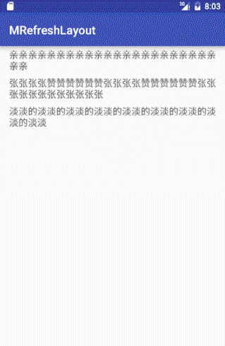

# PullMoreRefreshLayout

# 介绍
极其简洁的万用下拉刷新上拉加载实现。

# how to use
## 
      ...
        pullMoreRefreshLayout = (PullMoreRefreshLayout) findViewById(R.id.pm_freshlayout);

        stringAdapter = new StringAdapter(stringList);
        recyclerView.setAdapter(stringAdapter);

        pullMoreRefreshLayout.setOnRefreshListener(onRefreshListener);
        pullMoreRefreshLayout.setOnLoadMoreListener(onLoadMoreListener);
    ...

    PullMoreRefreshLayout.OnRefreshListener onRefreshListener = new PullMoreRefreshLayout.OnRefreshListener() {
        @Override
        public void onRefresh() {
            stringList.clear();
            stringList.add("亲亲亲亲亲亲亲亲亲亲亲亲亲亲亲亲亲亲亲亲亲亲亲亲");

            pullMoreRefreshLayout.postDelayed(new Runnable() {
                @Override
                public void run() {
                    pullMoreRefreshLayout.executeComplete();
                    stringAdapter.notifyDataSetChanged();
                }
            }, 2000);
        }
    };

    PullMoreRefreshLayout.OnLoadMoreListener onLoadMoreListener = new PullMoreRefreshLayout.OnLoadMoreListener() {
        @Override
        public void onLoadMore() {
            stringList.add("亲亲亲亲亲亲亲亲亲亲亲亲亲亲亲亲亲亲亲亲亲亲亲亲");
            pullMoreRefreshLayout.postDelayed(new Runnable() {
                @Override
                public void run() {
                    pullMoreRefreshLayout.executeComplete();
                    stringAdapter.notifyDataSetChanged();
                    recyclerView.scrollToPosition(stringList.size() - 2);
                }
            }, 2000);
        }
    };

#copyright
2016-8-30-

create by yan
# ToJcenterTest
